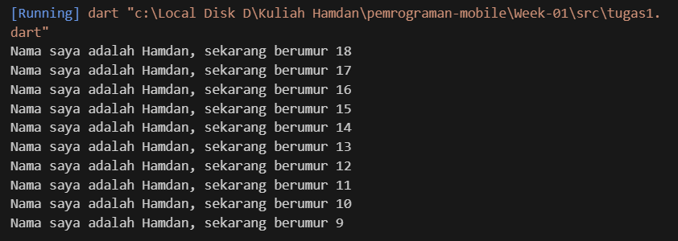
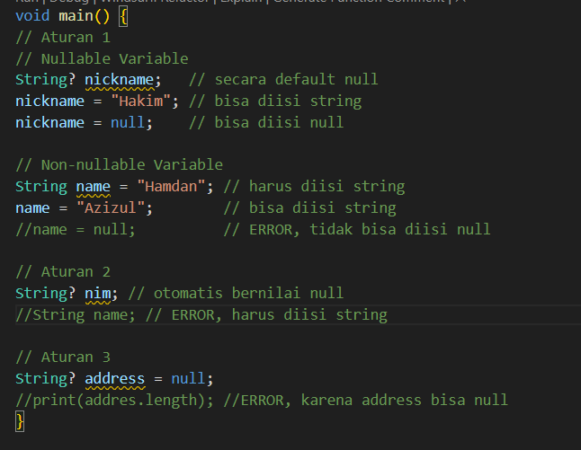
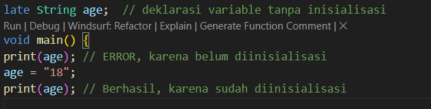

# Pemrograman Mobile - Week 2

NIM: 2341720251

NAMA: Hamdan Azizul Hakim

# Tugas Praktikum

1. Modifikasi kode

2. Framework Flutter menggunakan bahasa pemrograman dart, oleh karena itu kita perlu memahami dasar dari bahasa Dart itu sendiri agar memudahkan kita dalam memahami pengembangan framework Flutter.

3. Dart adalah bahasa pemrograman utama yang digunakan dalam framework Flutter. Dart termasuk bahasa modern dengan sifat lintas platform dan tujuan umum, sehingga dapat digunakan di berbagai sistem dan perangkat.

    Fitur penting Dart:

    + Productive tooling → memiliki alat bantu (tools) yang lengkap sehingga memudahkan proses pengembangan.
    + Garbage collection → otomatis mengelola memori dengan membersihkan data yang tidak digunakan.
    + Type annotations → memungkinkan penulisan tipe data agar kode lebih jelas dan mudah dipahami.
    + Statically typed → kesalahan tipe data dapat terdeteksi saat proses kompilasi, bukan saat program berjalan.
    + Portability → dapat dijalankan di berbagai platform tanpa banyak perubahan.

    Alasan Flutter menggunakan Dart: karena Dart selalu dikembangkan dengan fitur-fitur baru, membuatnya tetap relevan, fleksibel, dan cocok untuk kebutuhan aplikasi modern.

    Mode eksekusi Dart:

    - Just-In-Time (JIT) → kompilasi dilakukan saat program dijalankan, cocok untuk pengembangan karena lebih cepat melakukan perubahan.
    - Ahead-Of-Time (AOT) → kompilasi dilakukan sebelum program dijalankan, menghasilkan performa lebih cepat dan efisien saat aplikasi dipublikasikan.

    Paradigma Dart: dirancang sebagai Object-Oriented (OO), sehingga mendukung konsep kelas, objek, pewarisan, dan prinsip OOP lainnya.

4. Null safety adalah fitur Dart yang mencegah kita melakukan akses ke nilai null tanpa sengaja, sehingga menghindari error yang sering disebut null reference error (atau null pointer exception di bahasa lain).

    Ada 3 aturan null safety:
   
    

    Late variables adalah variabel non-nullable yang nilainya bisa ditunda (diinisialisasi belakangan) atau dihitung hanya ketika pertama kali digunakan (lazy initialization).

    
