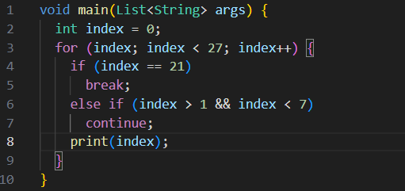

# Pemrograman Mobile - Week 3

**NIM:** 2341720251  
**Nama:** Hamdan Azizul Hakim  

---

## Praktikum 1

### Langkah 1

---

### Langkah 2
- Kode pada langkah 1 **error** karena penulisan `if else` salah pada baris 4 dan baris 6.

---

### Langkah 3

- Kode program error karena variabel `test` pada kondisi `if` bukan merupakan **boolean**.  
- Berikut perbaikannya:  

---

## Praktikum 2

### Langkah 1

---

### Langkah 2
- Kode pada langkah 1 error karena variabel `counter` **belum diinisialisasi**.  
- Berikut perbaikannya:  

---

### Langkah 3
- Pada langkah 3 kode program **tidak error** karena variabel `counter` sudah diinisialisasi di awal.  

---

## Praktikum 3

### Langkah 1

---

### Langkah 2
- Pada kode program langkah 1 error karena:  
  - Variabel belum diinisialisasi.  
  - Nama variabel tidak konsisten.  
  - Iterasi tidak berjalan.  

- Berikut perbaikannya:  

---

### Langkah 3
- Pada langkah 3:  
  - Penulisan `if else` salah.  
  - Nama variabel tidak konsisten.  
  - Operator logika `else if` saya ubah menjadi `&& (and)` agar terdapat output.  
  - Jika menggunakan `|| (or)` maka kondisi selalu `true` sehingga iterasi akan terus lanjut.  

---

## Tugas Praktikum

**Soal:**  
Buatlah program yang dapat menampilkan **bilangan prima dari 0 sampai 201** menggunakan Dart.  
Jika bilangan prima ditemukan, tampilkan **nama lengkap** dan **NIM** Anda.

---

### Kode Program

---

### Output
  

---
