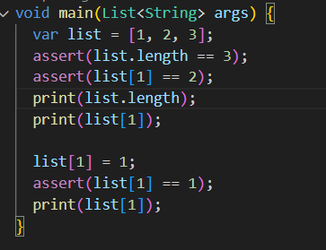
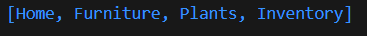

# Pemrograman Mobile - Week 4

**NIM:** 2341720251  
**Nama:** Hamdan Azizul Hakim  

---

## Praktikum 1

### Langkah 1

---

### Langkah 2
- `assert()` digunakan untuk **debugging**.  
- Jika kondisi di dalam `assert` **salah**, program akan berhenti dengan error.

---

### Langkah 3
  

- Output berupa seluruh elemen list dalam format array.

---

## Praktikum 2

### Langkah 1
  

---

### Langkah 2
- Membuat variabel `halogens` berisi elemen string.  
- Menampilkan isi dari variabel `halogens` menggunakan `print`.

---

### Langkah 3

- Pada kode tersebut terdapat tiga variabel yang dideklarasikan dengan cara berbeda. Variabel `names1` dibuat dengan `var names1 = <String>{};` sehingga jelas bahwa ia bertipe **Set kosong bertipe String**. Variabel `names2` menggunakan deklarasi `Set<String> names2 = {};`, dan karena tipe sudah ditentukan secara eksplisit sebagai `Set<String>`, maka tanda kurung kurawal `{}` di sini juga akan diartikan sebagai **Set kosong**. Berbeda dengan `names3`, saat ditulis `var names3 = {};`, Dart secara default menganggapnya sebagai **Map kosong dengan tipe `Map<dynamic, dynamic>`**, bukan Set. Hal ini karena `{}` tanpa petunjuk tipe selalu diasumsikan sebagai literal Map. Oleh karena itu, meskipun saat dicetak dengan `print()` ketiganya sama-sama menampilkan `{}`, sebenarnya `names1` dan `names2` adalah Set, sedangkan `names3` adalah Map. Akibatnya, jika kita mencoba menjalankan operasi khusus milik Set seperti `add()` pada `names3`, program akan error karena method tersebut tidak dimiliki oleh Map.

---

## Praktikum 3

### Langkah 1

---

### Langkah 2
- Pada percobaan langkah 1 kita membuat 2 variabel map bertipe Map<String, Object?> karena value bercampur antara String dan int.

---

### Langkah 3

- Pada langkah 3 kita membuat variabel map kosong mhs1 dan mhs2, selanjutnya kita ulang pada map gifts, sekarang berubah menjadi tipe Map<String, String> kemudian map nobleGases berubah menjadi tipe Map<int, String>

- Kode diatas merupakan penambahan elemen nama dan NIM pada tiap variabel di atas (gifts, nobleGases, mhs1, dan mhs2).

---

## Praktikum 4

### Langkah 1

---

### Langkah 2
- Kesalahan pada kode print(list1) karena list1 belum pernah dideklarasikan.

- Setelah perbaikan maka output seperti diatas, untuk variabel list diisi manual, kemudian variabel list2 diisi menggunakan spread operator dengan menambahkan elemen list ke list2.

---

### Langkah 3

- Kesalahan pada variabel list1 yang belum dideklarasikan. Setelah perbaikan, percobaan diatas yaitu deklarasi variabel list3 menggunakan spread operator dengan tanda tanya, tanda tanya digunakan untuk menghindari error karena variabel list1 yang akan dimasukkan ke list3 terdapat nilai null.

---

### Langkah 4
- Pada percobaan langkah 4 terjadi error karena variabel promoActive belum dideklarasikan.
- Variabel promoActive jika true

- Variabel promoActive jika true

---

### Langkah 5
- Sama seperti sebelumnya error dikarenakan variabel yang belum didefinisikan.
- Variabel login kondisi 'Manager'

- Variabel login kondisi 'Bos'

---

### Langkah 6
- Tidak terjadi error, pada percobaan ini kita mengisi variabel listOfStrings dengan int dari variabel listOfInts menggunakan perulangan for.

- Manfaat Collection For
    - Mempermudah pembuatan list berdasarkan loop.

    - Lebih singkat dan lebih jelas dibandingkan menambahkan elemen dengan for biasa.

    - Cocok untuk generate list secara dinamis.

---

## Praktikum 5

### Langkah 1

---

### Langkah 2
- Error hanya pada titik koma setelah print(record)     

- Diatas merupakan record yang bisa diakses menggunakan Positional field dan Named field.

---

### Langkah 3
- Tidak terjadi error, karena fungsi juga tidak dipanggil di main.

---

### Langkah 4
- Error karena record mahasiswa belum diinisialisasi, berikut perbaikannya:

---

### Langkah 5
- Tidak terjadi error, langkah 5 

- Gantilah salah satu isi record dengan nama dan NIM Anda

---

## Tugas Praktikum

#### 1. Silakan selesaikan Praktikum 1 sampai 5, lalu dokumentasikan berupa screenshot hasil pekerjaan Anda beserta penjelasannya!

#### 2. Jelaskan yang dimaksud Functions dalam bahasa Dart!
Functions merupakan kode yang bisa dipanggil berulang-ulang di main sesuai kebutuhan programmer.
#### 3. Jelaskan jenis-jenis parameter di Functions beserta contoh sintaksnya!
1. Parameter Wajib
> greet(String name, int age) {
  print("Halo $name, umurmu $age tahun");
}

> void main() {
  greet("Hamdan", 21); 
}

2. Parameter Opsional
> void greet(String name, [int? age]) {
  print("Halo $name, umurmu ${age ?? 'tidak diketahui'}");
}

>void main() {
  greet("Hamdan"); // tanpa umur
  greet("Budi", 20); 
}

3. Named Parameter

> void greet({required String name, int age = 18}) {
  print("Halo $name, umurmu $age tahun");
}

> void main() {
  greet(name: "Hamdan"); 
  greet(name: "Budi", age: 22);
}

####  4. Jelaskan maksud Functions sebagai first-class objects beserta contoh sintaknya!
Function dianggap sebagai objek (first-class objects) artinya function bisa: disimpan dalam variabel, dikirim sebagai argumen, dikembalikan sebagai nilai dari function lain.
> void sayHello(String name) {
  print("Hello, $name!");
}

> void main() {
  var myFunc = sayHello;
  myFunc("Hamdan");      
}

####  5. Apa itu Anonymous Functions? Jelaskan dan berikan contohnya!
Anonymous Function adalah function tanpa nama.Biasanya digunakan untuk fungsi singkat atau dipakai sekali (inline).
> void main() {
  var list = ['A', 'B', 'C'];

  > // Anonymous function di dalam forEach
  list.forEach((item) {
    print("Item: $item");
  });

  > // Versi singkat (arrow function)
  list.forEach((item) => print("Huruf: $item"));
}

####  6. Jelaskan perbedaan Lexical scope dan Lexical closures! Berikan contohnya!
1. Lexical Scope

Menentukan ruang lingkup (scope) variabel berdasarkan posisi kode dalam program.

Variabel hanya bisa diakses di dalam scope tempat ia didefinisikan.
> void main() {
  var a = 10;

  > void inner() {
    print(a); // bisa akses 'a' dari scope luar
  }

  > inner(); // Output: 10
}

2. Lexical Closure

Closure adalah function yang “mengingat” variabel dari scope di mana ia didefinisikan, meskipun scope itu sudah selesai dieksekusi.

> Function makeCounter() {
  int count = 0;

  > return () {
    count++;
    return count;
  };
}

> void main() {
  var counter = makeCounter();
  print(counter()); // 1
  print(counter()); // 2
  print(counter()); // 3
}

####  7. Jelaskan dengan contoh cara membuat return multiple value di Functions!
#### List
> List<int> hitung(int a, int b) {
  return [a + b, a - b];
}

> void main() {
  var hasil = hitung(10, 5);
  print("Tambah: ${hasil[0]}, Kurang: ${hasil[1]}");
}
#### Map
> Map<String, int> hitung(int a, int b) {
  return {
    "tambah": a + b,
    "kurang": a - b
  };
}

> void main() {
  var hasil = hitung(10, 5);
  print("Tambah: ${hasil['tambah']}, Kurang: ${hasil['kurang']}");
}
#### Record
> (int, int) hitung(int a, int b) {
  return (a + b, a - b);
}

> void main() {
  var (tambah, kurang) = hitung(10, 5);
  print("Tambah: $tambah, Kurang: $kurang");
}
