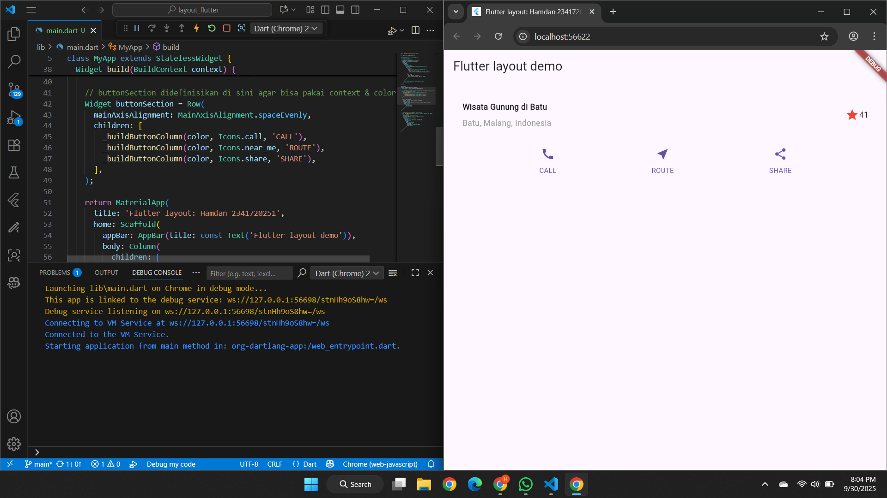
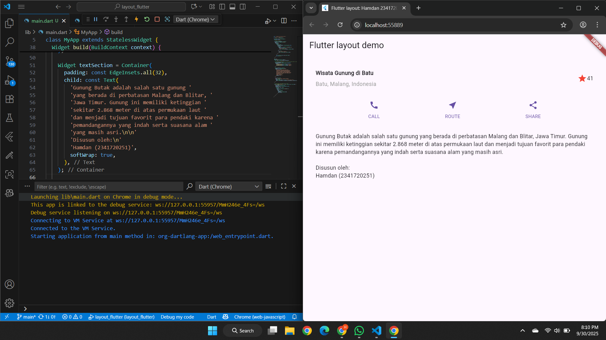

# Pemrograman Mobile - Week 6

**NIM:** 2341720251  
**Nama:** Hamdan Azizul Hakim  

---

## Praktikum 1

Pada Praktikum 1, saya membuat layout sederhana di Flutter dengan membuat project baru bernama **layout_flutter** dan menambahkan judul aplikasi sesuai nama dan NIM. Layout kemudian saya pecah menjadi beberapa elemen utama, lalu diimplementasikan bagian judul menggunakan kombinasi **Row, Column, Expanded, ikon bintang, dan teks**, yang dibungkus dalam variabel `titleSection` dan ditampilkan pada body aplikasi.

---

## Praktikum 2

Pada Praktikum 2, saya menambahkan **bagian tombol (button row)** pada layout dengan membuat method `_buildButtonColumn()` yang menghasilkan widget Column berisi ikon dan teks. Variabel `buttonSection` kemudian diisi Row dengan tiga tombol (CALL, ROUTE, SHARE) yang disejajarkan merata, lalu ditambahkan ke body bersama `titleSection`.

---

## Praktikum 3

Pada Praktikum 3, saya menambahkan **textSection** berupa Container dengan padding 32 piksel yang berisi widget Text dan properti `softWrap: true` agar teks menyesuaikan layar. Variabel ini kemudian ditambahkan ke body bersama `titleSection` dan `buttonSection`, sehingga layout menampilkan judul, tombol, dan deskripsi teks.

---

## Praktikum 4

Pada Praktikum 4, saya menambahkan **image section** dengan menyimpan gambar di folder *images*, mendeklarasikannya di `pubspec.yaml`, lalu menampilkannya menggunakan `Image.asset()` dengan `BoxFit.cover`. Selain itu, saya mengganti layout dari `Column` menjadi `ListView` agar tampilan bisa discroll otomatis, sehingga aplikasi kini memiliki layout lengkap berupa gambar, judul, tombol, dan teks deskripsi.

---

## Tugas Praktikum 1

Project: [basic_layout_flutter](basic_layout_flutter/lib/main.dart)

Source: [https://docs.flutter.dev/codelabs/layout-basics](https://docs.flutter.dev/codelabs/layout-basics)

Saya mengimplementasikan project **basic_layout_flutter** dengan menyusun layout menggunakan Column yang berisi gambar, judul, tiga tombol interaktif, dan text section deskripsi, di mana gambar ditampilkan menggunakan `Image.asset()` dengan `BoxFit.cover`. Pada tahap akhir, seluruh elemen diubah menjadi susunan `ListView` agar mendukung scroll otomatis sehingga tampilan tetap rapi dan mudah diakses di berbagai ukuran layar.

---

## Praktikum 5

Pada praktikum 5 saya mempelajari navigasi dan route di Flutter dengan membangun aplikasi belanja sederhana yang memiliki lebih dari satu halaman. Project dibuat dengan nama **belanja**, lalu saya membuat **HomePage** untuk daftar barang dan **ItemPage** untuk detail, serta mendefinisikan route di `main.dart` dengan `'/'` dan `'/item'`.

Data barang dimodelkan di `item.dart` dan ditampilkan pada HomePage menggunakan `ListView` dengan `Card` sebagai pembatas antar item. Setiap item dibungkus dengan `InkWell` agar bisa ditekan, lalu menggunakan `Navigator.pushNamed()` untuk berpindah ke halaman detail sekaligus mengirim data yang dipilih.

---

## Tugas Praktikum 2

Pada Tugas Praktikum 2 saya mengembangkan aplikasi belanja dari Praktikum 5 dengan menambahkan pengiriman data antar halaman menggunakan **arguments** pada `Navigator` dan membacanya dengan `ModalRoute` di `ItemPage`. Selain menampilkan nama dan harga, saya menambahkan atribut foto produk, stok, dan rating, serta mengubah daftar produk dari **ListView** menjadi **GridView** agar tampil seperti aplikasi marketplace.

Saya juga menambahkan **Hero widget** untuk animasi transisi gambar, memecah widget besar menjadi bagian lebih kecil, dan menyertakan footer berisi nama serta NIM. Sebagai eksplorasi, saya mencoba plugin **go_router** untuk navigasi yang lebih fleksibel.

---