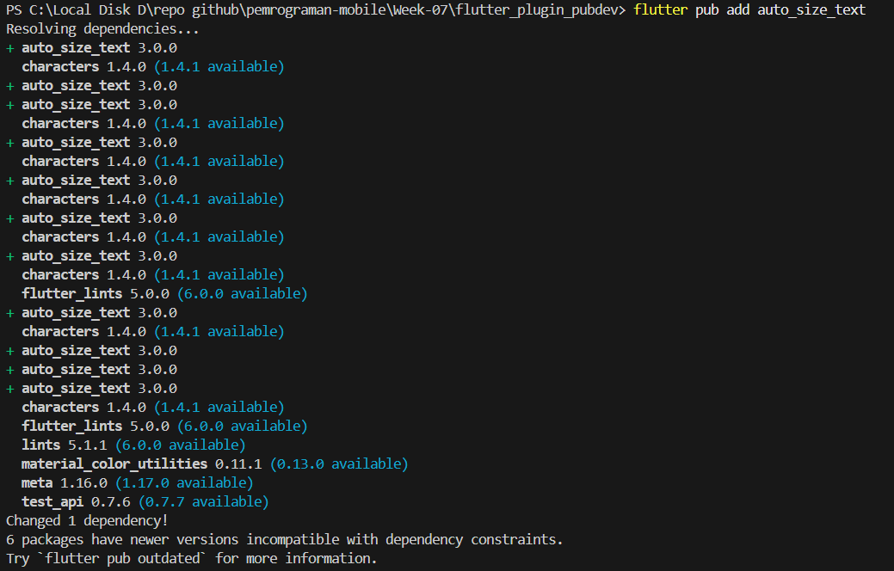
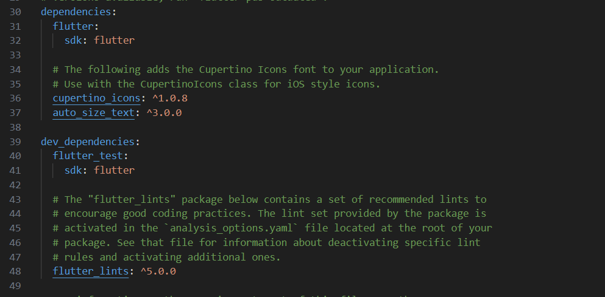
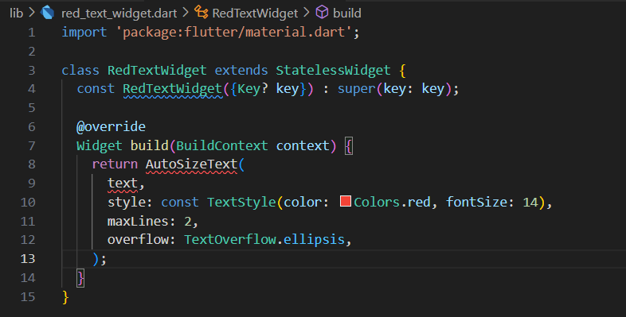
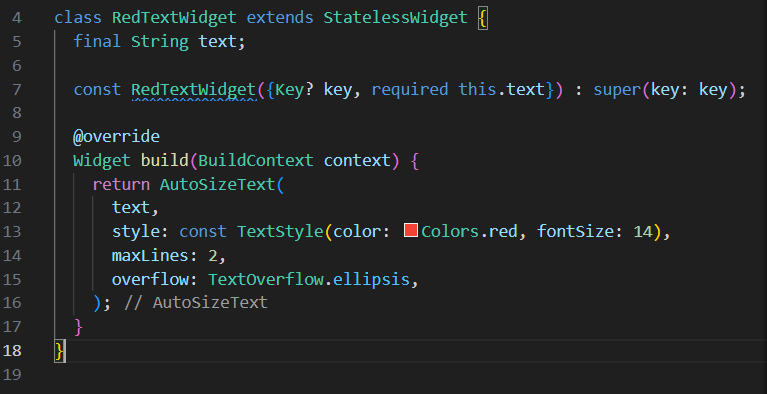
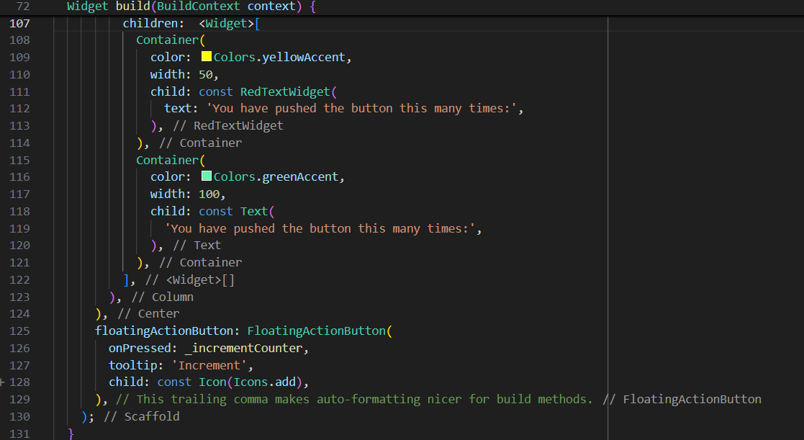
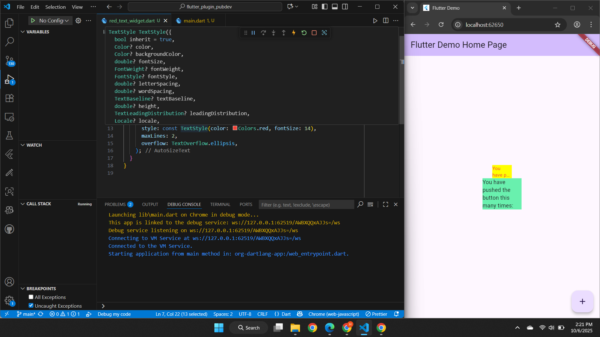

# Pemrograman Mobile - Week 7

**NIM:** 2341720251  
**Nama:** Hamdan Azizul Hakim  

---

## Tugas Praktikum

### Langkah 1
Membuat sebuah project flutter baru dengan nama flutter_plugin_pubdev.

---

### Langkah 2

Pada langkah 2 kita jalankan perintah `flutter pub add auto_size_text` pada terminal, tujuannya untuk menambahkan package (plugin) baru dari Pub.dev. Plugin auto_size_text menyediakan widget AutoSizeText yang secara otomatis menyesuaikan ukuran font agar teks dapat muat dalam ruang yang tersedia, berdasarkan batasan seperti maxLines atau batasan ukuran widget induk, menghindari overflow (teks melebihi batas).

---

### Langkah 3 & 4

---

### Langkah 5

Baris `final String text` mendeklarasikan variabel instance bernama text dengan tipe data String, variabel ini akan menyimpan teks yang nantinya ditampilkan oleh widget.

Baris `const RedTextWidget({Key? key, required this.text}) : super(key: key);` merupakan constructor dari widget yang bernama RedTextWidget yang memiliki parameter required this.text yang menjadikannya wajib diisi.

---

### Langkah 6

Terdapat 2 widget yang digunakan pada langkah 6:
1. Widget dengan menggunakan RedTextWIdget (AutoSizeWidget), fungsinya menampilkan teks menggunakan widget AutoSizeWidget sehingga akan secara otomatis mengecilkan ukuran font agar dapat muat dalam lebar 50 piksel dan maksimal 2 baris sesuai dengan pengaturan parameter pada AutoSizeWidget.

2. Text standar dengan menggunakan widget Text, fungsinya menampilkan teks dengan tidak secara otomatis menyesuaikan ukuran font, jika teks melebihi width yang telah ditentukan, maka teks akan terpotong.

---

### Output

---

## Parameter Plugin `auto_size_text`

Berikut penjelasan setiap parameter yang terdapat pada plugin **auto_size_text**:

| **Parameter** | **Deskripsi** |
|----------------|---------------------------------------------|
| **key*** | Mengontrol bagaimana satu widget menggantikan widget lain di dalam pohon widget (*widget tree*). |
| **textKey** | Menetapkan *key* untuk widget `Text` yang dihasilkan di dalam `AutoSizeText`. |
| **style*** | Jika tidak null, menentukan gaya teks yang digunakan (misalnya warna, ukuran huruf, jenis font, dll). |
| **minFontSize** | Batas ukuran teks **minimum** yang digunakan saat penyesuaian otomatis ukuran teks. Akan diabaikan jika `presetFontSizes` digunakan. |
| **maxFontSize** | Batas ukuran teks **maksimum** yang digunakan saat penyesuaian otomatis ukuran teks. Akan diabaikan jika `presetFontSizes` digunakan. |
| **stepGranularity** | Ukuran langkah penyesuaian font saat disesuaikan dengan batas (semakin kecil nilainya, semakin halus penyesuaian). |
| **presetFontSizes** | Menentukan ukuran font yang sudah ditetapkan sebelumnya. **Harus diurutkan dari yang terbesar ke yang terkecil.** |
| **group** | Menyinkronkan ukuran beberapa `AutoSizeText` agar memiliki ukuran huruf yang sama dalam satu kelompok. |
| **textAlign*** | Mengatur bagaimana teks disejajarkan secara horizontal (misalnya kiri, tengah, kanan). |
| **textDirection*** | Menentukan arah teks (misalnya kiri ke kanan atau kanan ke kiri). Hal ini memengaruhi interpretasi `TextAlign.start` dan `TextAlign.end`. |
| **locale*** | Digunakan untuk memilih font yang sesuai ketika karakter Unicode yang sama dapat ditampilkan berbeda tergantung lokal/bahasa. |
| **softWrap*** | Menentukan apakah teks boleh terputus di titik pemisah baris lunak (*soft line breaks*). |
| **wrapWords** | Menentukan apakah kata yang tidak muat di satu baris boleh dibungkus (dipindahkan ke baris berikutnya). Nilai default adalah `true` agar berperilaku seperti widget `Text`. |
| **overflow*** | Menentukan bagaimana teks yang melampaui batas tampilan akan ditangani (misalnya dipotong, diberi titik-titik, dll). |
| **overflowReplacement** | Menentukan widget pengganti yang akan ditampilkan jika teks terlalu panjang dan tidak muat di batas yang tersedia. |
| **textScaleFactor*** | Menentukan skala teks (berapa banyak piksel font untuk setiap piksel logis). Juga memengaruhi `minFontSize`, `maxFontSize`, dan `presetFontSizes`. |
| **maxLines** | Jumlah maksimum baris yang boleh digunakan oleh teks. |
| **semanticsLabel*** | Label alternatif untuk membantu fitur *screen reader* (aksesibilitas). |

> **Keterangan:**  
> Parameter yang ditandai dengan tanda `*` memiliki perilaku yang **sama seperti pada widget bawaan `Text`** di Flutter.
