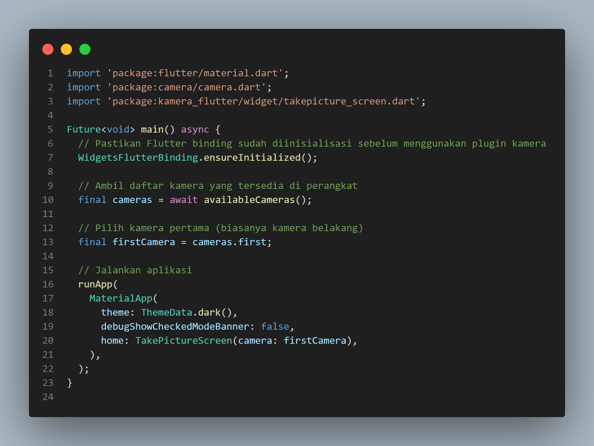
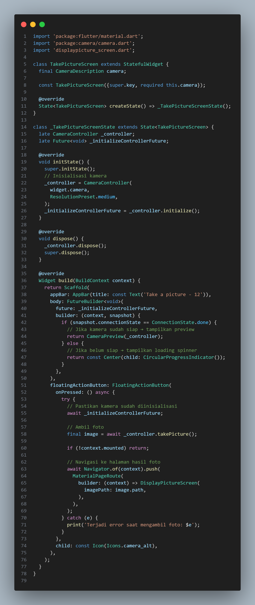
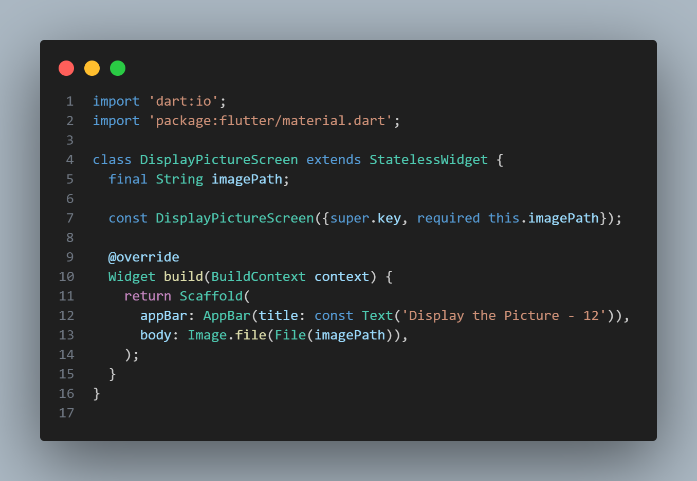

# Pemrograman Mobile - Week 9

**NIM:** 2341720251  
**Nama:** Hamdan Azizul Hakim  

---

## Praktikum 1

Pada Praktikum 1, kita implementasikan fungsionalitas kamera dasar di Flutter menggunakan package camera dan path_provider. Proses ini melibatkan inisialisasi CameraController untuk menampilkan preview kamera melalui FutureBuilder, menambahkan FloatingActionButton untuk memanggil metode takePicture(), dan kemudian menampilkan gambar yang telah diambil pada layar baru (DisplayPictureScreen) menggunakan Image.file.

---

## Praktikum 2

Pada Praktikum 2, saya membuat sebuah carousel filter foto interaktif yang menerapkan filter warna secara dinamis pada gambar. Ini dicapai dengan Stack yang berisi gambar dan widget carousel kustom; ValueNotifier digunakan untuk mengelola state warna filter, sementara PageController dan FlowDelegate kustom (CarouselFlowDelegate) digunakan untuk membuat efek geser yang mulus dengan perubahan skala dan opasitas pada item filter.

