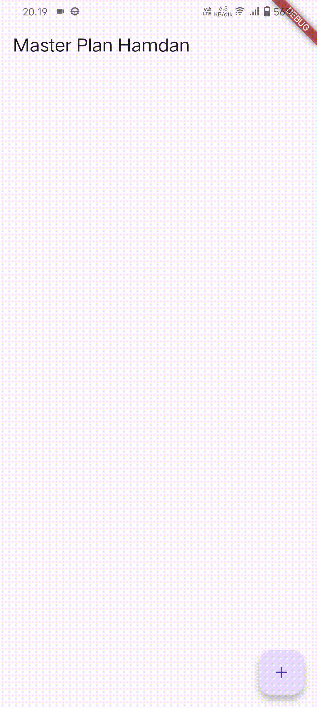
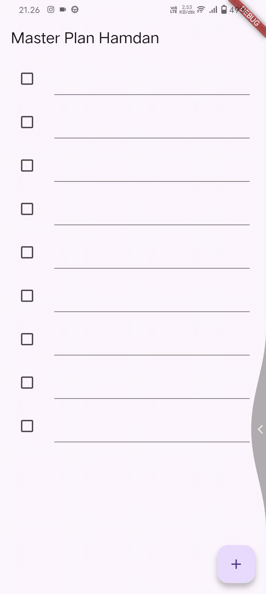
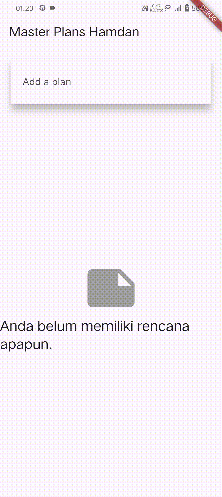

# Pemrograman Mobile – Week 10

**Nama:** Hamdan Azizul Hakim <br>
**NIM:** 2341720251 <br>
**Kelas:** TI-3G

---

## Praktikum 1 – Dasar State dengan Model–View

### Tujuan

Mempelajari dasar pengelolaan *state* pada Flutter dan menerapkan pola **Model–View** agar logika data dan tampilan terpisah dengan baik.

---

### Langkah-Langkah dan Penjelasan

#### Langkah 4 – Membuat Model

Pada langkah ini dibuat **class `Plan` dan `Task`** dalam file `plan.dart` dan `task.dart`.
Tujuannya adalah memisahkan **data (model)** dari **tampilan (view)**.

Model digunakan untuk:

* Menyimpan data rencana dan daftar tugas.
* Mengatur logika sederhana seperti menghitung jumlah tugas yang selesai.

**Mengapa dilakukan demikian:**
Karena prinsip *Model–View* menekankan bahwa data dan tampilan harus terpisah agar kode mudah dikelola dan diuji. Jika model diubah, tampilan tidak perlu dimodifikasi.

---

#### Langkah 6 – Menambahkan Variabel `plan`

Pada file `plan_screen.dart` dibuat variabel:

```dart
Plan plan = const Plan();
```

**Mengapa perlu variabel `plan`:**
Karena variabel ini menyimpan data state utama berupa daftar tugas yang akan ditampilkan dan dimodifikasi di layar.

**Mengapa dibuat `const`:**
Karena pada saat inisialisasi, objek `Plan` belum berubah dan bersifat tetap. Dengan `const`, Flutter dapat mengoptimalkan memori karena objek tidak perlu dibuat ulang.
Namun nantinya data di dalamnya akan diperbarui melalui mekanisme *stateful widget*.

---

#### Langkah 9 – Hasil Akhir Praktikum

Hasil akhir berupa aplikasi daftar tugas sederhana:

* Pengguna dapat menambahkan tugas baru.
* Menandai tugas selesai.
* Tampilan akan otomatis memperbarui jumlah tugas yang sudah selesai.

📸 **Hasil Capture (Langkah 9):**



---

#### Langkah 11 & 13 – Lifecycle Method

Pada `PlanScreen`, digunakan dua method dari *lifecycle stateful widget*:

| Method        | Fungsi                                                                                                       | Alasan Penggunaan                                               |
| ------------- | ------------------------------------------------------------------------------------------------------------ | --------------------------------------------------------------- |
| `initState()` | Dipanggil sekali saat widget pertama kali dibuat. Digunakan untuk inisialisasi seperti `ScrollController()`. | Agar komponen siap sebelum tampilan pertama kali dirender.      |
| `dispose()`   | Dipanggil ketika widget dihapus dari tree. Digunakan untuk membersihkan resource seperti controller.         | Mencegah kebocoran memori atau error ketika widget tidak aktif. |

Dengan dua method ini, pengelolaan resource menjadi lebih efisien dan aman.

---

## Praktikum 2 – InheritedWidget

### Tujuan

Mengelola data secara global dengan **InheritedWidget** dan **InheritedNotifier** sehingga semua widget yang memerlukan data dapat mengaksesnya tanpa meneruskan parameter berulang-ulang.

---

### Langkah-Langkah dan Penjelasan

#### Langkah 1 – InheritedWidget dan InheritedNotifier

Pada file `plan_provider.dart`, dibuat class:

```dart
class PlanProvider extends InheritedNotifier<ValueNotifier<Plan>> { ... }
```

**Yang dimaksud InheritedWidget:**
Adalah widget yang memungkinkan data dibagikan ke seluruh widget di bawahnya dalam *widget tree*.

**Mengapa menggunakan InheritedNotifier:**
Karena `InheritedNotifier` menggabungkan kemampuan *InheritedWidget* dengan *ValueNotifier*.
Setiap kali data berubah, *notifier* akan memberi tahu seluruh widget turunan agar *rebuild* otomatis tanpa harus memanggil `setState()`.

---

#### Langkah 3 – Method `of(context)`

Method ini biasanya didefinisikan seperti berikut:

```dart
static ValueNotifier<Plan> of(BuildContext context) {
  final provider = context.dependOnInheritedWidgetOfExactType<PlanProvider>();
  return provider!.notifier!;
}
```

**Maksudnya:**
Method ini digunakan untuk mengambil data dari `PlanProvider` di mana pun dalam widget tree.

**Mengapa dilakukan demikian:**
Agar widget dapat langsung mengakses `ValueNotifier<Plan>` tanpa perlu meneruskan data melalui constructor, sehingga kode lebih bersih dan terstruktur.

---

#### Langkah 9 – Hasil Akhir Praktikum

Aplikasi menampilkan daftar tugas yang otomatis memperbarui tampilan ketika pengguna menandai tugas selesai.

📸 **Hasil Capture (Langkah 9):**



---

## Praktikum 3 – State di Multiple Screens

### Tujuan

Mengelola *state* yang sama di beberapa layar (screen) dengan memindahkan data ke tingkat yang lebih tinggi dan tetap sinkron antarhalaman.

---

### Penjelasan dan Analisis

#### Diagram (Langkah 13)

Diagram menunjukkan perbedaan antara *sebelum* dan *sesudah* pemindahan state:

| Kondisi             | Penjelasan                                                                                                                                  |
| ------------------- | ------------------------------------------------------------------------------------------------------------------------------------------- |
| **Sebelum (kiri)**  | State hanya dikelola di satu layar (`PlanCreatorScreen`), sehingga perubahan tidak terlihat di layar lain.                                  |
| **Sesudah (kanan)** | State dikelola di `PlanProvider` di atas seluruh screen. Semua halaman yang mengakses provider akan menampilkan data yang sama dan sinkron. |

**Maksudnya:**
Konsep ini disebut **Lift State Up**, yaitu memindahkan data ke widget yang lebih tinggi agar beberapa screen dapat berbagi dan memperbarui data yang sama.

---

#### Langkah 14 – Hasil Akhir Praktikum

Aplikasi kini dapat:

* Membuat lebih dari satu plan.
* Membuka setiap plan untuk menambah atau menyelesaikan tugas di dalamnya.
* Semua perubahan tersimpan secara konsisten berkat penggunaan `ValueNotifier` yang dibungkus `InheritedNotifier`.

📸 **Hasil Capture (Langkah 14):**



**Penjelasan:**
GIF menunjukkan pengguna membuat beberapa rencana berbeda dan menambahkan tugas pada masing-masing plan. Semua data tetap tersinkronisasi saat berpindah antar-screen.

---
