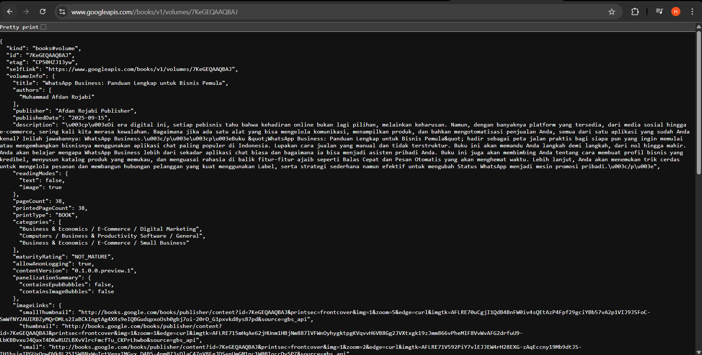

# Pemrograman Mobile – Week 11

**Nama:** Hamdan Azizul Hakim  
**NIM:** 2341720251  
**Kelas:** TI-3G

---

## Praktikum 1 – Mengunduh Data dari Web Service (API)

Pada Praktikum ini pertama kita membuat project flutter baru dengan nama books, setelah itu kita tambahkan dependensi baru yaitu http yang berfungsi untuk menghubungkan flutter ke jaringan HTTP.

Setelah itu kita lakukan perubahan pada kode main dan juga menambahkan nama kita pada title. Selanjutnya kita cari buku favorit di Google Books, kemudian kita salin ID buku tersebut ke path yang ada di kode main.

Kemudian kita coba akses URL dengan ID baru yang telah kita tambahkan. Maka akan tampil data JSON seperti dibawah:

