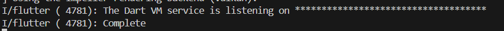
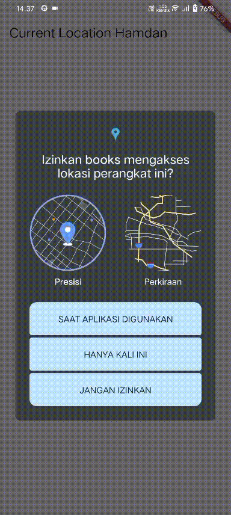

# Pemrograman Mobile – Week 11

**Nama:** Hamdan Azizul Hakim  
**NIM:** 2341720251  
**Kelas:** TI-3G

---

## Praktikum 1 – Mengunduh Data dari Web Service (API)

Pada Praktikum ini pertama kita membuat project flutter baru dengan nama books, setelah itu kita tambahkan dependensi baru yaitu http yang berfungsi untuk menghubungkan flutter ke jaringan HTTP.

Setelah itu kita lakukan perubahan pada kode main dan juga menambahkan nama kita pada title. Selanjutnya kita cari buku favorit di Google Books, kemudian kita salin ID buku tersebut ke path yang ada di kode main.

Kemudian kita coba akses URL dengan ID baru yang telah kita tambahkan. Maka akan tampil data JSON seperti dibawah:

Langkah selanjutnya kita tambahkan kode untuk menampilkan data JSON diatas ke dalam aplikasi books kita, pada kode tambahan terdapat method **substring** yang berfungsi untuk membatasi panjang data yang ditampilkan di UI aplikasi books dan juga method **catchError** yang berfungsi untuk mengambil pesan error jika terdapat error.

Berikut hasil output aplikasi books pada praktikum 1:

---

## Praktikum 2 – Menggunakan await/async untuk menghindari callbacks

Pada Praktikum 2, langkah 1 kita tambahkan tiga method di dalam class `_FuturePageState`. Kode di atas berisi tiga fungsi asinkron di Dart `returnOneAsync()`, `returnTwoAsync()`, dan `returnThreeAsync()` yang masing-masing menunggu selama **3 detik** menggunakan `Future.delayed()` sebelum mengembalikan nilai **1**, **2**, dan **3**. Karena menggunakan kata kunci `async` dan `await`, eksekusi setiap fungsi tidak langsung menghasilkan nilai, melainkan **mengembalikan objek `Future<int>`** yang akan berisi hasilnya setelah penundaan selesai. Dengan kata lain, fungsi-fungsi ini mensimulasikan proses yang memerlukan waktu (seperti mengambil data dari internet) tanpa menghentikan eksekusi program utama.

Pada langkah 2, kita membuat method `count()` yang bersifat **asinkron** untuk menjalankan tiga fungsi sebelumnya (`returnOneAsync()`, `returnTwoAsync()`, dan `returnThreeAsync()`) secara **berurutan**. Fungsi ini menggunakan `await` agar setiap pemanggilan menunggu hasil dari fungsi sebelumnya sebelum melanjutkan ke berikutnya, sehingga prosesnya berjalan berantai, total waktu tunda menjadi sekitar 9 detik (3 detik tiap fungsi). Nilai yang dikembalikan dari ketiga fungsi tersebut dijumlahkan dan disimpan ke variabel `total`. Setelah perhitungan selesai, `setState()` dipanggil untuk memperbarui nilai variabel `result` di UI, sehingga tampilan aplikasi ikut berubah sesuai hasil total yang baru.

Berikut hasil output pada praktikum 2:

---

## Praktikum 3 – Menggunakan Completer di Future

Pada Praktikum 3 kita tambahkan kode yang menggunakan konsep **`Completer`** di Dart untuk membuat **Future yang dapat dikontrol secara manual**. Pertama, variabel `completer` dideklarasikan sebagai `late Completer`, artinya akan diinisialisasi sebelum dipakai. Method `getNumber()` membuat instance `Completer<int>()` baru, memanggil fungsi `calculate()`, dan mengembalikan `completer.future` — sebuah `Future<int>` yang akan selesai di kemudian hari. Fungsi `calculate()` menunggu **5 detik** menggunakan `Future.delayed()`, lalu memanggil `completer.complete(42)` untuk **menyelesaikan Future** dan mengembalikan nilai 42. Dengan cara ini, `Completer` memungkinkan kamu memisahkan logika perhitungan atau penentuan nilai dari proses Future itu sendiri, sehingga kamu bisa menyelesaikan Future kapan pun kamu mau.

Berikut hasil output dari praktikum diatas:

Langkah selanjutnya kita tambahkan kode yang berisi fungsi `calculate2()`dan juga mengubah kode pada fungsi onPressed().

Perbedaan antara kode sebelumnya dengan kode terbaru terletak pada **penanganan error dan cara mendapatkan hasil Future**. Pada kode sebelumnya, fungsi `calculate()` hanya menunggu 5 detik menggunakan `Future.delayed()` lalu menyelesaikan `Future` dengan nilai 42, tanpa ada mekanisme untuk menangani kemungkinan error. Sedangkan pada kode terbaru, fungsi `calculate()` dibungkus dengan **try-catch**, sehingga jika terjadi kesalahan selama eksekusi, `Future` akan diselesaikan dengan error menggunakan `completer.completeError({})`. Selain itu, pemanggilan `getNumber()` menggunakan **`.then()`** untuk menangani hasil normal dan memperbarui UI melalui `setState()`, serta **`.catchError()`** untuk menangani error dan menampilkan pesan yang sesuai. Dengan demikian, kode terbaru lebih aman dan robust karena siap menghadapi exception tanpa membuat aplikasi crash, sementara kode sebelumnya hanya cocok untuk kasus sederhana tanpa kemungkinan error.

Berikut hasil output dari praktikum diatas:

---

## Praktikum 4 – Memanggil Future secara paralel

Pada Praktikum 4, kita memperkenalkan penggunaan **`FutureGroup`** untuk menjalankan beberapa `Future` secara **bersamaan (concurrent)** dan menunggu semua selesai sebelum melanjutkan. Konsepnya adalah menambahkan beberapa `Future` ke dalam sebuah `FutureGroup`, lalu menutup grup tersebut agar menandai tidak ada `Future` tambahan. Setelah semua `Future` selesai, hasilnya dikumpulkan menjadi sebuah list, kemudian dijumlahkan dan disimpan ke variabel `result` melalui `setState()` agar UI diperbarui. Dengan pendekatan ini, semua `Future` dijalankan **bersamaan**, sehingga total waktu eksekusi lebih efisien dibanding menjalankan setiap `Future` secara berurutan.

Berikut output pada praktikum diatas:

Perbedaan antara penggunaan `FutureGroup` dan `Future.wait` terletak pada **cara pengelolaan dan fleksibilitas penambahan `Future`**. Pada `FutureGroup`, kita bisa menambahkan `Future` satu per satu, menutup grup saat semua `Future` telah ditambahkan, lalu menunggu semua selesai, sehingga lebih fleksibel jika jumlah atau sumber `Future` tidak diketahui di awal. Sedangkan `Future.wait` menerima **list `Future` secara langsung** dan menunggu semuanya selesai secara bersamaan, sehingga lebih sederhana dan cocok ketika semua `Future` sudah pasti dan bisa langsung dikumpulkan. Secara eksekusi, keduanya menjalankan semua `Future` **bersamaan (concurrent)**, tetapi `Future.wait` lebih ringkas, sementara `FutureGroup` memberikan kontrol lebih terhadap proses penambahan dan penyelesaian `Future` secara dinamis.

---

## Praktikum 5 – Menangani Respon Error pada Async Code

Pada praktikum ini kita melakukan cara untuk menangani operasi asinkron yang menghasilkan error menggunakan `Future` di Flutter. Fungsi `returnError()` mensimulasikan proses yang memerlukan waktu dua detik lalu melemparkan exception dengan pesan “Something terrible happened!”. Saat tombol **GO!** ditekan, fungsi ini dipanggil, dan hasilnya ditangani dengan tiga blok: `.then()` untuk menangani keberhasilan (mengubah `result` menjadi "Success"), `.catchError()` untuk menangani kegagalan (menyimpan pesan error ke dalam `result`), dan `.whenComplete()` yang selalu dijalankan di akhir proses, baik berhasil maupun gagal (di sini hanya mencetak teks “Complete” di konsol). Dengan demikian, kode ini mendemonstrasikan alur lengkap penanganan `Future` beserta error handling dan tindakan akhir.

Berikut hasil output dari praktikum diatas:

  

Langkah selanjutnya kita menambahkan fungsi `handleError`. Perbedaannya terletak pada cara menangani error dari proses asinkron, di mana versi yang menggunakan `.then()`, `.catchError()`, dan `.whenComplete()` memanfaatkan **callback chaining** untuk menangani hasil, error, dan tindakan akhir dari `Future`, sedangkan versi dengan `try–catch–finally` menangani semuanya di dalam satu blok `async` secara lebih terstruktur dan mudah dibaca. Dengan `try–catch`, error ditangkap langsung seperti pada pemrograman sinkron, sementara `finally` tetap dijalankan setelah proses selesai, baik berhasil maupun gagal. Pendekatan ini umumnya lebih jelas dan direkomendasikan ketika terdapat banyak operasi asinkron yang perlu ditangani secara berurutan.

---

## Praktikum 6 – Menggunakan Future dengan StatefulWidget

Pertama kita membuat file `geolocation.dart` yang menampilkan lokasi pengguna menggunakan package **Geolocator**. Di dalamnya, fungsi `getPosition()` meminta izin akses lokasi, memeriksa apakah layanan lokasi aktif, lalu mengambil posisi terkini berupa **latitude** dan **longitude**. Nilai tersebut ditampilkan pada layar setelah proses selesai, sementara sebelum itu muncul indikator loading. Namun, ketika dijalankan di **browser**, aplikasi tidak akan mendapatkan koordinat GPS sebenarnya karena browser tidak memiliki akses langsung ke perangkat keras GPS seperti halnya di perangkat Android atau iOS. Pada web, Geolocator hanya dapat menggunakan lokasi berbasis IP atau izin lokasi browser, sehingga akurasi dan ketersediaannya sangat terbatas.

Berikut hasil output dari praktikum diatas:

---

## Praktikum 7 - Manajemen Future dengan FutureBuilder

Pada UI praktikum ini dengan sebelumnya terdapat perbedaan, menggunakan FutureBuilder lebih efisien, clean, dan reactive dengan Future bersama UI.

Berikut hasil outputnya:

 

Setelah ditambah handling error tidak ada perbedaan UI dengan sebelumnya, jika memang terdapat error maka UI akan berbeda.

Berikut hasil outputnya:

 

## Praktikum 8 - Navigation route dengan Future Function

Pada Praktikum ini kita tambahkan kode untuk menampilkan dua layar Flutter yang saling terhubung menggunakan **Navigator** untuk berpindah halaman dan mengirimkan data balik. Pada layar pertama (`NavigationFirst`), terdapat tombol **“Change Color”** yang ketika ditekan akan membuka layar kedua (`NavigationSecond`). Di layar kedua, pengguna dapat memilih salah satu dari tiga tombol warna (Red, Green, atau Blue); ketika salah satu ditekan, fungsi `Navigator.pop(context, color)` dijalankan untuk **menutup halaman kedua dan mengirimkan nilai warna yang dipilih kembali ke halaman pertama**. Setelah itu, nilai warna tersebut diterima melalui `await Navigator.push(...)` dan disimpan ke variabel `color`, lalu `setState()` dijalankan untuk memperbarui tampilan layar pertama. Akibatnya, setiap kali tombol di layar kedua diklik, **background color** layar pertama berubah sesuai warna yang dipilih, karena proses navigasi sekaligus pengembalian data berhasil dilakukan melalui mekanisme asynchronous `Navigator.push` dan `Navigator.pop`.

Berikut hasil outputnya: 

 
