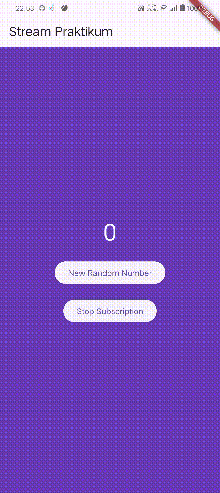
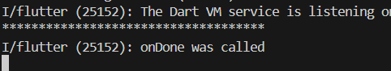
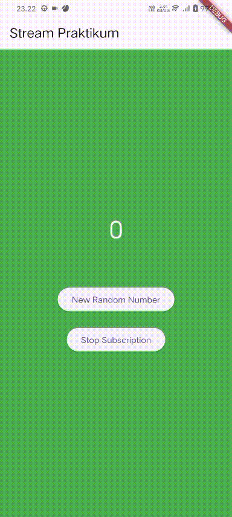
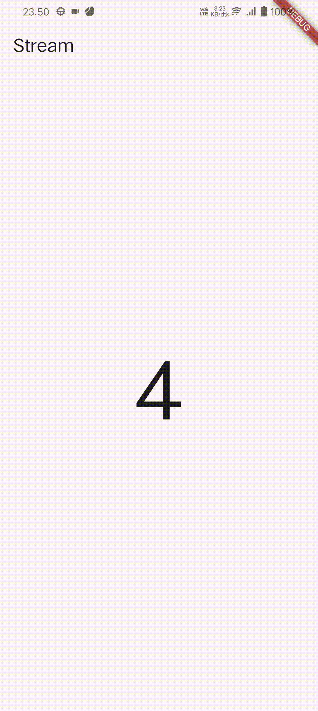

# Pemrograman Mobile – Week 12

**Nama:** Hamdan Azizul Hakim  
**NIM:** 2341720251  
**Kelas:** TI-3G

---

## Praktikum 1 – Dart Streams

Pada Praktikum 1, kita mempelajari struktur dasar aplikasi Flutter, mulai dari main() yang menjalankan runApp(), lalu MyApp sebagai StatelessWidget untuk mengatur konfigurasi aplikasi melalui MaterialApp, dan StreamHomePage sebagai StatefulWidget yang mengelola state melalui kelas _StreamHomePageState.

Keyword yield* digunakan untuk meneruskan seluruh data dari stream lain ke stream utama, sehingga nilai yang dihasilkan Stream.periodic setiap detik dapat langsung diteruskan untuk menampilkan warna secara berurutan dari daftar colors.

Berikut ouput:

Perbedaan listen() dan await for terletak pada cara menangani stream: listen() bersifat non-blocking dan langsung menjalankan callback setiap data diterima, sedangkan await for memproses data secara berurutan dan menunggu stream hingga selesai sehingga cocok untuk alur yang membutuhkan urutan.

---

## Praktikum 2 – Stream controllers dan sinks

Pada Praktikum 2, kita menambahkan fitur stream angka yang memungkinkan aplikasi menghasilkan dan menampilkan angka acak secara real time menggunakan `NumberStream` dan `StreamController`. Perubahannya meliputi inisialisasi stream angka di `initState()`, mendengarkan aliran data menggunakan `listen()` untuk memperbarui nilai `lastNumber`, serta membuat fungsi `addRandomNumber()` yang mengirim angka baru ke stream. Selain itu, kita juga menambahkan penanganan lifecycle dengan menutup stream pada `dispose()` agar tidak terjadi kebocoran memori. Dengan perubahan ini, aplikasi tidak hanya mengganti warna background secara periodik, tetapi juga mampu memproses input angka secara dinamis melalui mekanisme stream.

Berikut ouput:

Langkah 13 sampai 15 bertujuan untuk menambahkan **simulasi error dan penanganannya di dalam Stream**, sehingga aplikasi dapat merespons kesalahan ketika terjadi error pada aliran data. Pada **Langkah 13**, method `addError()` ditambahkan ke dalam `NumberStream` untuk mengirimkan error ke stream melalui `controller.sink.addError('error')`, bukan data biasa. Pada **Langkah 14**, kita menambahkan `onError()` pada `listen()` di `initState()`, sehingga ketika stream menerima error, aplikasi akan menangani kondisi tersebut—misalnya dengan mengubah `lastNumber` menjadi `-1` untuk memberi sinyal bahwa terjadi kesalahan. Pada **Langkah 15**, method `addRandomNumber()` diubah agar tidak lagi mengirim angka acak, tetapi memicu error dengan memanggil `numberStream.addError()`. Dengan ketiga langkah ini, praktikum menunjukkan bagaimana stream dapat mengirim error, bagaimana listener menangkapnya, dan bagaimana aplikasi menampilkan perubahan state ketika error terjadi.

---

## Praktikum 3 – Injeksi data ke streams

Kode tersebut mendeklarasikan dan menginisialisasi `StreamTransformer` yang memproses data dari *stream* dengan mengalikan setiap nilai masuk dengan 10 serta mengganti error menjadi `-1`, lalu menerapkan transformer tersebut pada *stream* angka sehingga setiap data hasil transformasi digunakan untuk memperbarui nilai `lastNumber` melalui `setState`, memungkinkan UI Flutter berubah secara real-time sesuai data *stream* yang diterima.

---

## Praktikum 4 – Subscribe ke stream events

Pada **langkah 2**, kode menginisialisasi `StreamSubscription` melalui `stream.listen()` untuk mulai mendengarkan setiap event yang dikirimkan oleh `StreamController`, lalu memperbarui UI dengan nilai terbaru atau menampilkan `-1` bila terjadi error; fitur `onDone` juga disiapkan agar mengetahui kapan stream berhenti. Pada **langkah 6**, method `dispose()` menutup `StreamController` dan membatalkan `StreamSubscription` menggunakan `subscription.cancel()`, yang merupakan praktik terbaik untuk mencegah memory leak dan memastikan tidak ada event yang masih berjalan setelah widget dihapus. Pada **langkah 8**, method `addRandomNumber()` diperbarui agar hanya menambah data ke stream jika `StreamController` belum ditutup; jika stream sudah berhenti, UI akan di-set ke `-1` sebagai penanda bahwa stream tidak lagi menerima input.

---

## Praktikum 5 – Multiple stream subscriptions

Error **“Bad state: Stream has already been listened to”** terjadi karena pada kode Anda, *stream* yang berasal dari `numberStreamController.stream` adalah **single-subscription stream**, tetapi Anda mencoba mendengarkannya **dua kali** melalui `subscription = stream.listen(...)` dan `subscription2 = stream.listen(...)`; sementara tipe stream ini **hanya boleh memiliki satu listener aktif**, sehingga ketika listener kedua ditambahkan, Flutter langsung melempar error tersebut sebagai proteksi agar stream tidak digunakan melebihi kapasitas yang diizinkan.

Hal itu terjadi karena stream angka yang digunakan diubah menjadi **broadcast stream**, sehingga bisa memiliki lebih dari satu listener, dan pada kode tersebut memang dibuat **dua subscription** (`subscription` dan `subscription2`) yang keduanya mendengarkan stream yang sama. Setiap kali tombol ditekan dan angka dikirim ke stream, kedua listener menerima event tersebut secara terpisah dan masing-masing mengeksekusi `setState()` yang menambahkan angka ke variabel `values`. Akibatnya, setiap angka yang dipancarkan stream dicatat **dua kali**, satu dari setiap subscription, sehingga teks angka bertambah dua kali lipat.

---

## Praktikum 6 – Multiple stream subscriptions

Pada langkah 3, kode dalam `stream.dart` membuat kelas `NumberStream` yang menghasilkan aliran data (stream) berupa angka acak setiap satu detik menggunakan `Stream.periodic`, sehingga setiap detik stream memancarkan nilai baru tanpa perlu dipicu oleh tombol. Sementara pada langkah 7, method `build()` menampilkan hasil stream tersebut di UI: variabel `lastNumber` diperbarui oleh listener dan ditampilkan sebagai teks, sedangkan `StreamBuilder` memantau stream secara langsung dan memperbarui tampilan setiap kali data baru masuk, sehingga angka yang dihasilkan stream terlihat secara real-time; tombol **New Random Number** tetap disediakan jika stream menggunakan controller manual, tetapi fungsi utamanya di sini adalah menampilkan data stream secara otomatis dan responsif di antarmuka.

