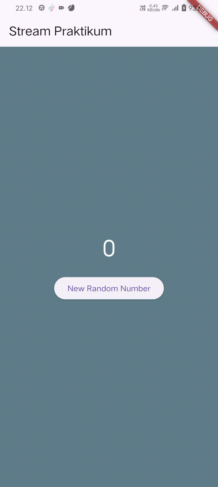
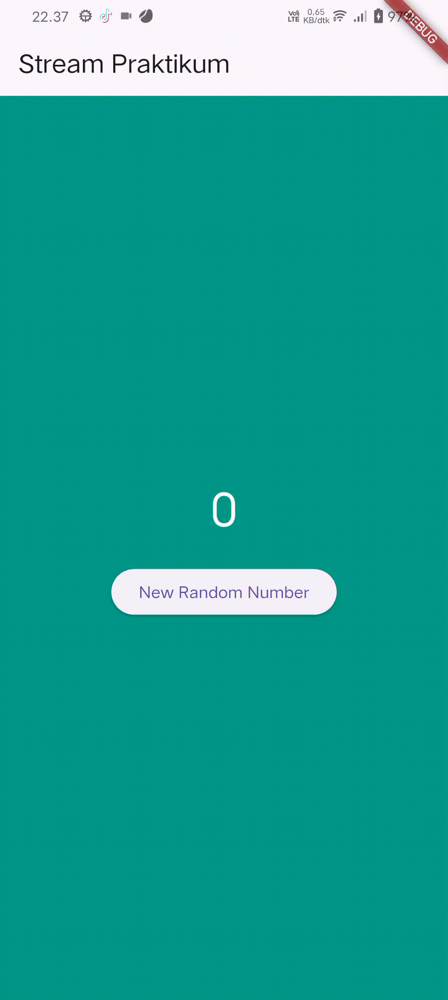

# Pemrograman Mobile – Week 12

**Nama:** Hamdan Azizul Hakim  
**NIM:** 2341720251  
**Kelas:** TI-3G

---

## Praktikum 1 – Dart Streams

Pada Praktikum 1, kita mempelajari struktur dasar aplikasi Flutter, mulai dari main() yang menjalankan runApp(), lalu MyApp sebagai StatelessWidget untuk mengatur konfigurasi aplikasi melalui MaterialApp, dan StreamHomePage sebagai StatefulWidget yang mengelola state melalui kelas _StreamHomePageState.

Keyword yield* digunakan untuk meneruskan seluruh data dari stream lain ke stream utama, sehingga nilai yang dihasilkan Stream.periodic setiap detik dapat langsung diteruskan untuk menampilkan warna secara berurutan dari daftar colors.

Berikut ouput:

Perbedaan listen() dan await for terletak pada cara menangani stream: listen() bersifat non-blocking dan langsung menjalankan callback setiap data diterima, sedangkan await for memproses data secara berurutan dan menunggu stream hingga selesai sehingga cocok untuk alur yang membutuhkan urutan.

---

## Praktikum 2 – Stream controllers dan sinks

Pada Praktikum 2, kita menambahkan fitur stream angka yang memungkinkan aplikasi menghasilkan dan menampilkan angka acak secara real time menggunakan `NumberStream` dan `StreamController`. Perubahannya meliputi inisialisasi stream angka di `initState()`, mendengarkan aliran data menggunakan `listen()` untuk memperbarui nilai `lastNumber`, serta membuat fungsi `addRandomNumber()` yang mengirim angka baru ke stream. Selain itu, kita juga menambahkan penanganan lifecycle dengan menutup stream pada `dispose()` agar tidak terjadi kebocoran memori. Dengan perubahan ini, aplikasi tidak hanya mengganti warna background secara periodik, tetapi juga mampu memproses input angka secara dinamis melalui mekanisme stream.

Berikut ouput:

Langkah 13 sampai 15 bertujuan untuk menambahkan **simulasi error dan penanganannya di dalam Stream**, sehingga aplikasi dapat merespons kesalahan ketika terjadi error pada aliran data. Pada **Langkah 13**, method `addError()` ditambahkan ke dalam `NumberStream` untuk mengirimkan error ke stream melalui `controller.sink.addError('error')`, bukan data biasa. Pada **Langkah 14**, kita menambahkan `onError()` pada `listen()` di `initState()`, sehingga ketika stream menerima error, aplikasi akan menangani kondisi tersebut—misalnya dengan mengubah `lastNumber` menjadi `-1` untuk memberi sinyal bahwa terjadi kesalahan. Pada **Langkah 15**, method `addRandomNumber()` diubah agar tidak lagi mengirim angka acak, tetapi memicu error dengan memanggil `numberStream.addError()`. Dengan ketiga langkah ini, praktikum menunjukkan bagaimana stream dapat mengirim error, bagaimana listener menangkapnya, dan bagaimana aplikasi menampilkan perubahan state ketika error terjadi.

---

## Praktikum 3 – Injeksi data ke streams

Kode tersebut mendeklarasikan dan menginisialisasi `StreamTransformer` yang memproses data dari *stream* dengan mengalikan setiap nilai masuk dengan 10 serta mengganti error menjadi `-1`, lalu menerapkan transformer tersebut pada *stream* angka sehingga setiap data hasil transformasi digunakan untuk memperbarui nilai `lastNumber` melalui `setState`, memungkinkan UI Flutter berubah secara real-time sesuai data *stream* yang diterima.

