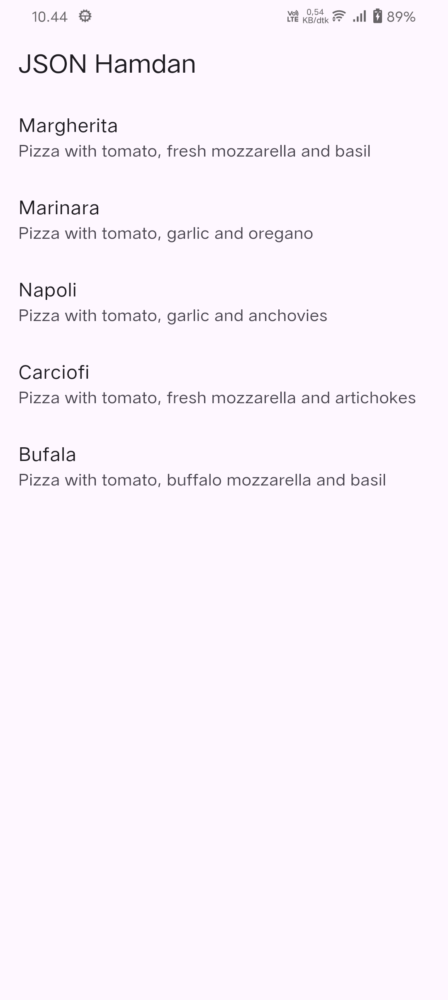
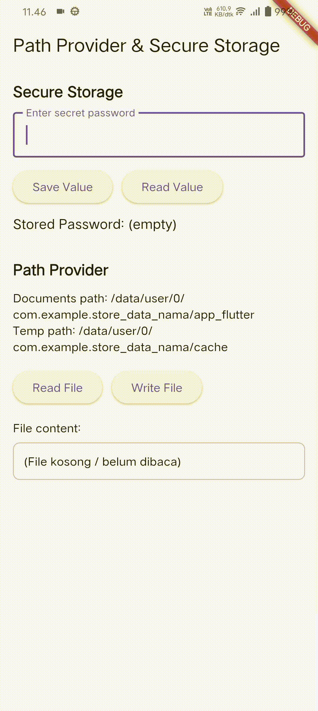

# Pemrograman Mobile – Week 13

**Nama:** Hamdan Azizul Hakim  
**NIM:** 2341720251  
**Kelas:** TI-3G

---

## Praktikum 1 – Konversi Dart model ke JSON

Praktikum 1 bertujuan memperkenalkan cara melakukan **persistensi data dasar di Flutter** dengan membaca file JSON dari folder assets, menampilkannya, lalu mengubahnya menjadi **objek Dart (deserialization)** dan kembali menjadi JSON lagi (**serialization**). Anda membuat project baru, menambahkan file JSON (pizzalist.json), membaca isinya menggunakan `rootBundle.loadString`, menampilkan raw JSON di layar, lalu membuat model `Pizza` untuk mengonversi JSON ke objek Dart menggunakan `fromJson`. Setelah itu Anda menampilkan data dalam bentuk ListView yang rapi. Terakhir, Anda menambahkan fungsi `toJson()` dan `jsonEncode()` untuk mengubah kembali List objek Pizza menjadi JSON string dan mencetaknya ke console. Praktikum ini mengajarkan alur lengkap konversi **JSON ⇄ Dart model** sebagai dasar penyimpanan data di Flutter.

---

## Praktikum 2 – Handle kompatibilitas data JSON

Praktikum 2 berfokus pada cara menangani **data JSON yang tidak konsisten atau rusak** agar aplikasi Flutter tetap berjalan tanpa error. Anda mensimulasikan file JSON bermasalah, lalu memperbaiki model `Pizza` dengan membuat parsing lebih aman menggunakan `int.tryParse`, `double.tryParse`, operator null-coalescing (`??`), serta `toString()` untuk memastikan kompatibilitas tipe data. Selain menghindari crash ketika JSON berisi tipe yang salah, nilai hilang, atau null, Anda juga memperbaiki tampilan UI menggunakan operator ternary agar tidak muncul tulisan "null", tetapi diganti dengan teks alternatif seperti "No name". Praktikum ini mengajarkan cara membuat model data yang **tangguh**, mampu membaca JSON yang tidak rapi, dan tetap menampilkan informasi yang layak bagi pengguna.

---

## Praktikum 3 – Menangani error JSON

Praktikum 3 berfokus pada membuat proses parsing JSON **lebih aman dan mudah dirawat** dengan mengganti semua string literal kunci JSON di model `Pizza` menjadi **konstanta**. Dengan membuat konstanta seperti `keyId`, `keyName`, dan lainnya, Anda mencegah error akibat salah ketik (typo) pada nama kunci JSON yang biasanya sulit dideteksi karena tidak menghasilkan error kompilasi. Kode menjadi **lebih safe** karena risiko bug berkurang dan perubahan struktur JSON dapat dilakukan cukup dengan memperbarui satu tempat saja. Kode juga **lebih maintainable** karena lebih rapi, konsisten, dan mudah diperbarui ketika API atau struktur JSON mengalami perubahan, tanpa harus mencari dan mengubah banyak string literal di berbagai baris kode.

---

## Praktikum 4 – SharedPreferences

Praktikum 4 mengajarkan cara menyimpan data sederhana secara **persisten** di Flutter menggunakan **SharedPreferences**, yaitu penyimpanan key–value yang tetap tersimpan meskipun aplikasi ditutup. Anda menambahkan dependensi `shared_preferences`, lalu membuat fungsi untuk membaca data counter dari storage, memberikan nilai default jika belum ada, menambah nilai tersebut, menyimpannya kembali menggunakan `prefs.setInt()`, dan menampilkan hasilnya di UI. Setiap kali aplikasi dibuka, counter otomatis meningkat. Anda juga membuat tombol “Reset counter” yang menghapus seluruh data SharedPreferences menggunakan `prefs.clear()`. Praktikum ini memperkenalkan konsep penyimpanan lokal yang ringan dan cepat untuk data non-kompleks seperti angka, boolean, dan string.

---

## Praktikum 5 – Akses filesystem dengan path_provider

Praktikum 5 mengajarkan cara mengakses **filesystem perangkat** menggunakan package `path_provider`, yang digunakan Flutter untuk menemukan direktori penting seperti **Application Documents Directory** dan **Temporary Directory**. Anda menambahkan dependensi, mengimpor library, lalu membuat method `getPaths()` untuk mengambil dua lokasi tersebut menggunakan `getApplicationDocumentsDirectory()` dan `getTemporaryDirectory()`. Hasilnya kemudian disimpan dalam state dan ditampilkan di UI. Praktikum ini penting karena menjadi dasar penyimpanan file lokal, seperti membuat file JSON, menyimpan gambar, atau mengelola cache aplikasi.

---

## Praktikum 6 – Akses filesystem dengan direktori

Praktikum 6 melanjutkan penggunaan filesystem dengan memanfaatkan **dart:io** untuk membuat, menulis, dan membaca file secara langsung di direktori dokumen aplikasi. Anda menambahkan variabel `myFile` dan `fileText`, kemudian membuat fungsi `writeFile()` untuk menulis teks ke file, serta fungsi `readFile()` untuk membaca kembali isi file dan menampilkannya di UI. Dalam initState, file diinisialisasi menggunakan path yang diperoleh dari praktikum sebelumnya, lalu langsung dilakukan penulisan awal. Setelah tombol “Read File” ditekan, isi file muncul di layar. **Maksud kode pada langkah 3** adalah membuat fungsi yang mencoba menulis teks (yang diganti dengan nama lengkap dan NIM Anda) ke file dan mengembalikan true/false sebagai indikator keberhasilan, sehingga aman dari error. **Maksud kode pada langkah 7** adalah menjalankan aplikasi dan menguji bahwa proses baca–tulis file berjalan benar; ketika tombol ditekan, konten file yang sudah ditulis akan terbaca dan ditampilkan, memastikan fungsi filesystem bekerja sebagaimana mestinya.

---

## Praktikum 7 – Menyimpan data dengan enkripsi/dekripsi

Praktikum 7 berfokus pada cara menyimpan data secara **aman** menggunakan package `flutter_secure_storage`, yang sangat cocok untuk data sensitif seperti password. Anda menambahkan dependensi secure storage, membuat controller untuk input, lalu menginisialisasi objek penyimpanan aman dengan key tertentu. Selanjutnya Anda membuat dua fungsi: `writeToSecureStorage()` untuk menyimpan teks terenkripsi ke storage, dan `readFromSecureStorage()` untuk mengambilnya kembali. Pada UI, Anda menambahkan TextField untuk memasukkan password serta dua tombol — Save Value dan Read Value — yang masing-masing menjalankan fungsi penyimpanan dan pembacaan. Setelah dijalankan, aplikasi dapat menyimpan dan membaca kembali data dengan aman, membuktikan bahwa proses enkripsi/dekripsi berlangsung dengan benar.

---
