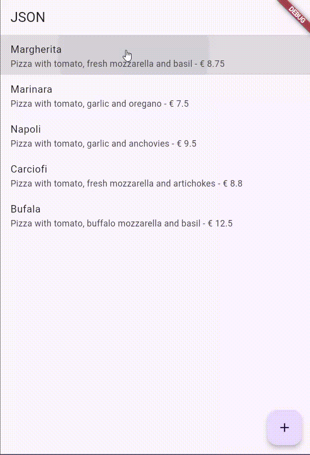

# Pemrograman Mobile – Week 14

**Nama:** Hamdan Azizul Hakim  
**NIM:** 2341720251  
**Kelas:** TI-3G

---

## Praktikum 1 – Membuat layanan Mock API

Praktikum 1 berfokus pada pembuatan layanan mock API menggunakan Wiremock Cloud dan menghubungkannya dengan aplikasi Flutter untuk menampilkan data dari server. Dalam praktikum ini, kita membuat stub baru di Wiremock dengan endpoint /pizzalist yang mengembalikan data JSON daftar pizza. Kemudian, di Flutter, kita menambahkan dependensi http, membuat kelas HttpHelper untuk mengambil data dari endpoint tersebut, serta menambahkan metode callPizzas() dan FutureBuilder di main.dart untuk menampilkan data pizza dalam bentuk ListView. Setelah aplikasi dijalankan, daftar pizza dari layanan mock akan muncul di layar. Pada bagian akhir, praktikum memperkenalkan pola singleton agar kelas HttpHelper hanya dibuat satu kali dan dapat digunakan di seluruh aplikasi secara efisien.

---

## Praktikum 2 – Mengirim Data ke Web Service (POST)

Praktikum 2 mengajarkan cara mengirim data baru ke layanan web menggunakan metode HTTP POST dalam aplikasi Flutter. Pada praktikum ini, kita membuat stub POST di layanan Wiremock agar server mock menerima request ke endpoint /pizza dan merespons dengan pesan sukses. Di Flutter, kita menambahkan metode postPizza untuk mengirim objek Pizza dalam format JSON ke server, lalu membuat layar PizzaDetailScreen yang menyediakan input melalui beberapa TextField untuk mengisi data pizza baru. Setelah tombol Send Post ditekan, data tersebut dikirim ke server dan hasil respons ditampilkan di layar. Dengan demikian, praktikum ini menunjukkan bagaimana aplikasi Flutter dapat menambahkan data baru ke server melalui aksi POST.

---

## Praktikum 3 – Memperbarui Data di Web Service (PUT)

Praktikum 3 menjelaskan cara memperbarui data yang sudah ada di layanan web menggunakan metode HTTP **PUT** pada Flutter. Pada praktikum ini, kita terlebih dahulu membuat stub PUT di Wiremock agar server mock dapat menerima permintaan update pada endpoint `/pizza` dan memberikan respons sukses. Di Flutter, kita menambahkan fungsi `putPizza` untuk mengirim data pizza yang diperbarui ke server. Selanjutnya, layar `PizzaDetailScreen` dimodifikasi sehingga dapat digunakan baik untuk menambah pizza baru maupun mengedit pizza yang sudah ada, dengan memanfaatkan parameter `isNew` untuk menentukan apakah aplikasi memanggil `postPizza` atau `putPizza`. Ketika pengguna mengetuk salah satu item pizza di halaman utama, aplikasi membuka layar detail dengan data pizza yang dipilih, memungkinkan pengguna mengubah informasi dan menyimpannya, sehingga data tersebut diperbarui di server. Praktikum ini menunjukkan perbedaan penggunaan POST dan PUT serta bagaimana membangun UI Flutter yang mendukung proses update data.

---

## Praktikum 4 – Menghapus Data dari Web Service (DELETE)

Praktikum 4 mengajarkan cara menghapus data dari layanan web menggunakan metode HTTP **DELETE** di Flutter. Pada praktikum ini, kita membuat stub DELETE pada Wiremock agar server mock merespons permintaan penghapusan dengan pesan sukses. Di sisi Flutter, kita menambahkan fungsi `deletePizza` dalam `HttpHelper` untuk mengirim request DELETE ke endpoint `/pizza`. Kemudian, daftar pizza pada tampilan dibuat dapat dihapus dengan membungkus setiap `ListTile` dalam widget `Dismissible`, sehingga ketika pengguna melakukan swipe pada item, data pizza akan dihapus dari daftar aplikasi sekaligus dikirim ke server untuk dihapus. Dengan demikian, praktikum ini menunjukkan alur lengkap penghapusan data dari UI hingga server.

---